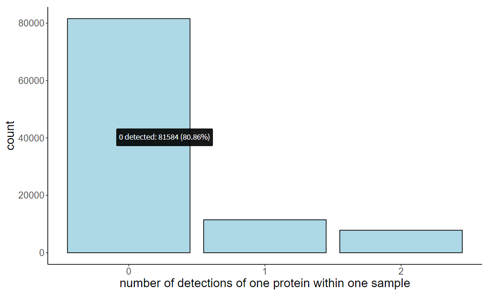
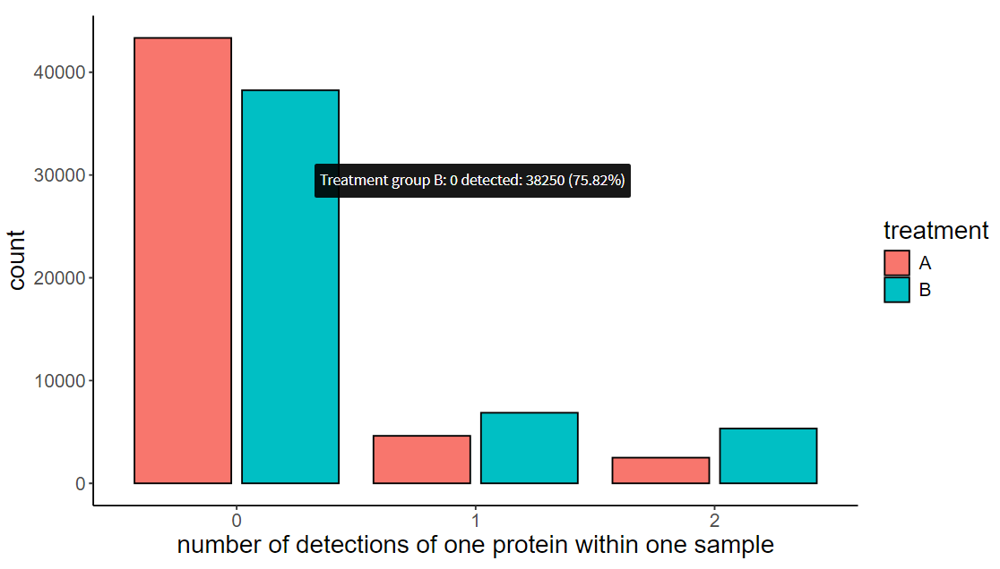

# Barplot of number of detections

Each sample has one or more replicates at the run level - one can visualize how many times a protein has been detected within a sample (e.g. if there are 2 replicates for each sample, protein can be detected in both replicates of the given sample, in only one of them or in no replicate at all).

This visualization has one bar for each unique count of protein detections within given sample (minimum is zero, maximum is the maximum number of replicates within a sample). Height of the bars is a frequency of occurrence of a protein-sample pair with a given number of detections (sum of the bar heights is equal to the product of the number of proteins and the number of samples).

You can choose whether to display:
* one joint barplot (without grouping by treatment)

{width=90%}

* grouped barplot (with grouping by treatment)

{width=90%}

In the second case, bars are distinguished by color based on treatment group.

### Interactive infobox

When you hover the mouse cursor over a particular bar, an info box appears with some information depending on whether you have selected a grouping or not.
* without grouping:
    * number of detections (see bar label)
    * absolute frequency of occurrence of a protein-sample pair with a given number of detections
    * percentage frequency of occurrence of a protein-sample pair with a given number of detections
* with grouping:
    * name of the treatment group
    * number of detections (see bar label)
    * absolute frequency of occurrence of a protein-sample pair with a given number of detections within given group
    * percentage frequency of occurrence of a protein-sample pair with a given number of detections within given group (sums up to 100 % for each group)

