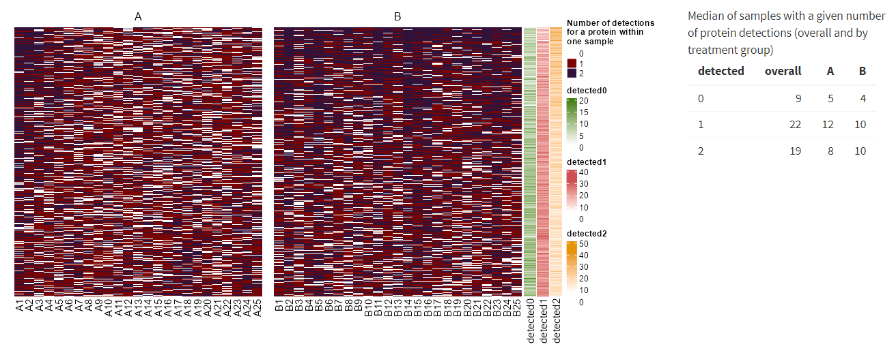

# Heatmap of detections within a sample

Each sample has one or more replicates at the run level - one can visualize how many times a protein has been detected within a sample (e.g. if there are 2 replicates for each sample, protein can be detected in both replicates of the given sample, in only one of them or in no replicate at all).

This visualization offers a more detailed view than the barplot of number of detections (see above) - you can see each protein-sample pair with the information on how many replicates of the sample the protein was detected in (minimum is zero, maximum is the maximum number of replicates within a sample). Each unique count has its color. Heatmap columns are divided according to treatment group.

In addition, the heatmap is accompanied by annotation columns with row totals for individual detection counts - these show how many times the protein was detected within the sample zero times, once, etc.

The table next to the graph provides information on the median number of samples with a given detection number (overall and by group).

{width=90%}

