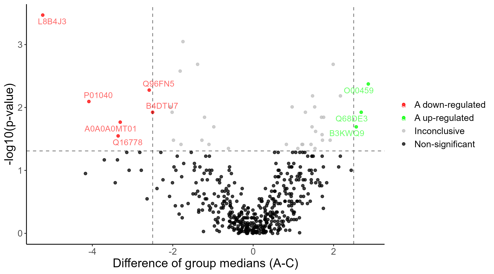

# Volcano plot

This plot is used for the pair of groups tested (or selected if more than one group is tested at the same time). Each row of the results table (i.e. each protein) represents one point in this plot. On the x-axis is the difference in group medians, on the y-axis the original or adjusted p-value can be plotted when using a two-sample test, but transformed to compress non-significant results to zero and conversely highlight small p-values indicating a statistically significant difference - hence the p'= -log10(p) transformation is used. When testing multiple groups, the p-value from multiple comparison (Tukey or Dunn test) is used instead of the p-value of the test.

The area of the plot is divided into 4 parts -- non-significant, inconclusive and significant results with dominant abundances of one or the other group. The terms Non-significant, Inconclusive and 'Group' up-regulated (upper right part of the plot)/'Group' down-regulated (upper left part of the graph) are used by default to denote these groups, where 'Group' is replaced by the reference group (or the one mentioned first in the x-axis label for the median difference). The points are then categorised according to which part of the graph they are in, colour-coded and, for significant results (up- or down-regulated), the protein accession number is appended to the point. 

{width=90%}

The level of the horizontal line (p-value threshold) and vertical lines (absolute median difference threshold) can be individually set by the user using the Edit plot appearance button. **P-value threshold value must be set in the original scale (not transformed) -- the transformation is done automatically.**

### Interactive infobox

When you hover the mouse cursor over a particular point, an info box appears with some information about that protein (in this order):
* accession number
* difference of group medians
* back-transformed p-value from the y-axis (original, adjusted or the one from the multiple comparison)
