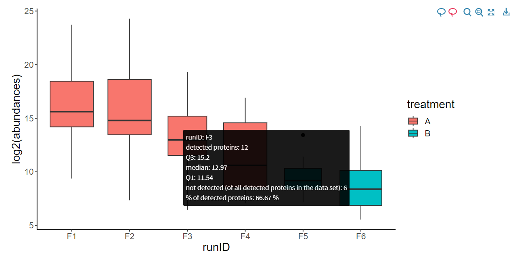

# Boxplot of abundances by runs/samples

Each boxplot is calculated based on abundance values within **one run** (Exploratory data analysis tab) or **one sample** (Aggregation tab).

On the run level, you can choose one of the below form of abundances according to your needs:
* just the values (those shown in the table on the previous tab)
* log-transformed values (log2 is used)
* log2(x+1) (to deal with zeros)
* square root or the original values

**Remember:** after data transformation (see the Transformation tab) use only the "just the values" option (means the current version of the dataset) to avoid e.g. double logarithming.

There is no selection on the sample level (since it is assumed that aggregated data are transformed or there is no need to do it).

Boxplots are distinguished by color based on treatment group of the specific run/sample. Their width varies depending on the number of detected proteins.

### Interactive infobox

When you hover the mouse cursor over a particular boxplot, an info box appears with some information about that run/sample (in this order):
* runID/sampleID
* number of detected proteins within that run/sample
* upper quartile of abundances
* median abundance
* lower quartile of abundances
* number of proteins that were not detected (out of all proteins detected in the data set)
* percentage of detected proteins (detected/(detected + not detected))
    * subtract this number from 100% to get the missing value rate

{width=100%}
