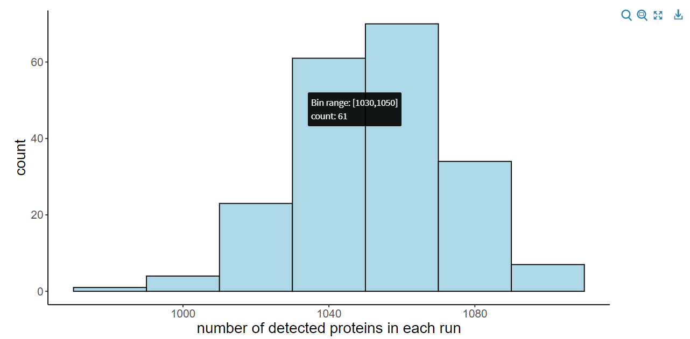
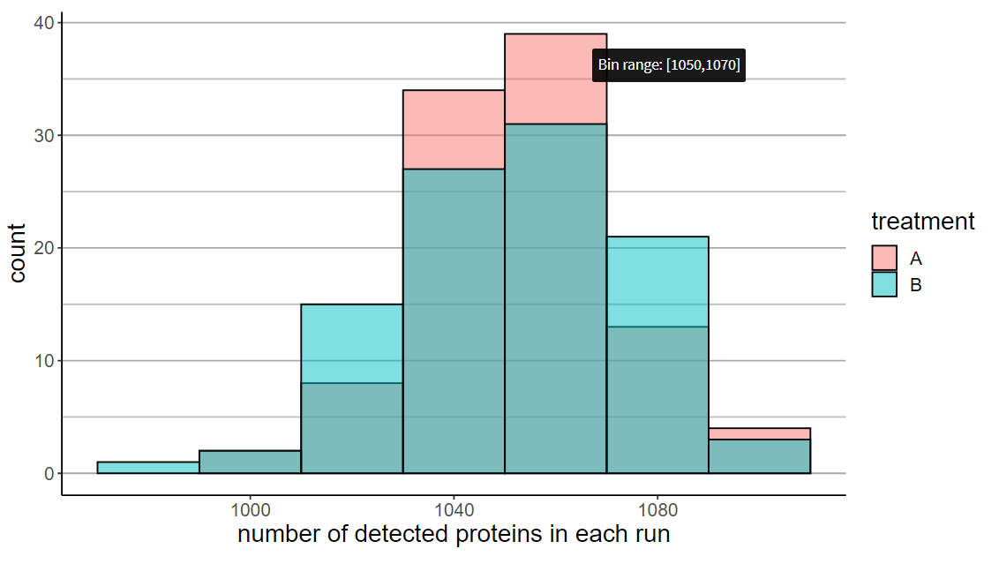

# Histogram of detected proteins in each run

In each run a certain number of proteins are detected. This visualization divides the x-axis (number of proteins detected) to the bins. The displayed columns (one for each bin) reach the height of the number of runs with detected proteins within a bin.

For example, if a column within bin [1030,1050] reaches a height of 61, it means that between 1030 a 1050 proteins were detected in 61 runs.

You can choose whether to display:
* one joint histogram (without grouping by treatment)

{width=90%}

* one histogram for each treatment group (with grouping).

{width=90%}

In the second case, histograms are distinguished by color based on treatment group. You can set the transparency parameter alpha (from 0 to 1) as desired -- default is 0.5.

### Interactive infobox

When you hover the mouse cursor over a particular column, an info box appears with some information depending on whether you have selected a grouping or not.
* without grouping:
    * bin range
    * number of runs within that bin (count)
* with grouping:
    * bin range only (due to the possibility of overlapping histograms)

To compensate missing 'count' info in the second version of info box, there are grid lines that make it easier to read this information from the axis.

